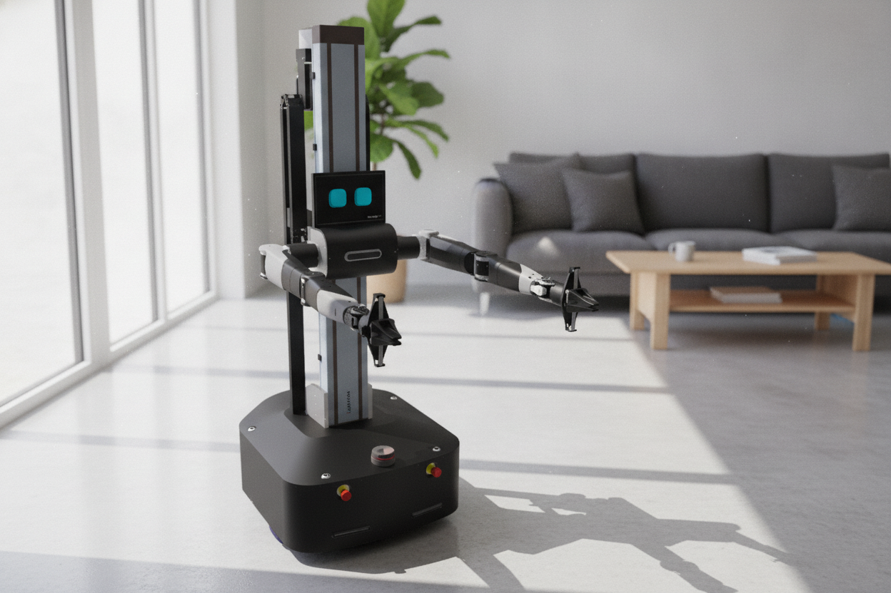
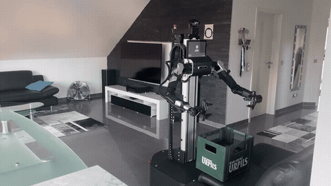

<a id="language-selection"></a>

## Sprache / Language

- Deutsch: [Zur deutschen Version](#de-start)
- English: [Jump to English version](#en-start)

# ThorBot

<p align="center">
  
</p>

DIY wheeled humanoid robot for Physical AI research, built with industrial like components.

[](./LICENSE)
[](./CHANGELOG.md)
[](https://github.com/ThorstenBrach/ThorBot/commits/main)
[](#de-ueberblick)

---

<a id="de-start"></a>

## Deutsch

[Zur Sprachauswahl](#language-selection)

ThorBot ist ein Open-Source-Humanoid-Roboter für Physical-AI-Forschung, aufgebaut aus industrienahen Komponenten. Das Projekt befindet sich in aktiver Entwicklung: Die mechanische und elektrische Plattform ist weitgehend definiert, die Software ist derzeit eine rudimentäre Erstimplementierung.

### Inhaltsverzeichnis

- [Projekt auf einen Blick](#de-ueberblick)
- [Repository-Übersicht](#de-repos)
- [Vision und Ausblick](#de-vision)
- [Demo](#de-demo)
- [Projektstruktur](#de-struktur)
- [Bill of Materials](#de-bom)
- [Changelog](#de-changelog)
- [Lizenz](#de-lizenz)

<a id="de-ueberblick"></a>

### Projekt auf einen Blick

| Thema | Details |
|---|---|
| Projekttyp | DIY Humanoid-Roboter (fahrend) |
| Fokus | Physical AI Research |
| Bauweise | Industrienahe Komponenten |
| Lizenz | MIT |
| Status | Under Construction (frühe Entwicklung) |

<a id="de-repos"></a>

### Repository-Übersicht

Das Projekt ist in mehrere spezialisierte Repositories aufgeteilt. Hardware-nahe Anteile (Konstruktion, CAD, Firmware, Beschreibungsmodelle) sind weitgehend nutzbar. Die Software-Komponenten sind frühe Arbeitsstände: funktionale erste Implementierungen, die schrittweise zu einer ROS-2-basierten Architektur ausgebaut werden.

| Repository | Beschreibung | Status |
|---|---|---|
| [ThorBot_Driver](https://github.com/ThorstenBrach/ThorBot_Driver) | Treiber für die ThorBot-Hardware (z.B. PL-2303 RS232) | Basis |
| [ThorBot_Firmware](https://github.com/ThorstenBrach/ThorBot_Firmware) | Firmware und Low-Level-Control für Agilex Nero | Basis |
| [ThorBot_Hardware](https://github.com/ThorstenBrach/ThorBot_Hardware) | CAD, 3D-Druck, Assembly, EPlan, Manuals, URDF | Basis |
| [ThorBot_ROS_URDF](https://github.com/ThorstenBrach/ThorBot_ROS_URDF) | URDF/Xacro-Roboterbeschreibung und Meshes für ROS | Basis |
| [ThorBot_Software_EmotionEngine](https://github.com/ThorstenBrach/ThorBot_Software_EmotionEngine) | Emotions- und Face-Engine (TypeScript-Monorepo) | Under Construction |
| [ThorBot_Software_Nero_Server](https://github.com/ThorstenBrach/ThorBot_Software_Nero_Server) | TCP/IP-Server für den Agilex-Nero-Arm | Under Construction |
| [ThorBot_Software_PLC](https://github.com/ThorstenBrach/ThorBot_Software_PLC) | TwinCAT PLC und TwinSAFE Projekte | Under Construction |
| [ThorBot_Software_ST3215_Server](https://github.com/ThorstenBrach/ThorBot_Software_ST3215_Server) | Servo-Bridge für ST3215-Servos (Python/rustypot) | Under Construction |
| [ThorBot_Tools](https://github.com/ThorstenBrach/ThorBot_Tools) | Tools und Hilfsskripte (Feetech, JMC) | Basis |

<a id="de-vision"></a>

### Vision und Ausblick

Das langfristige Ziel ist eine offene Plattform für Physical AI:

- ROS-2-basierte Softwarearchitektur für Steuerung, Navigation und Manipulation
- KI-gestützte Perzeption und Interaktion
- Vollständige, nachbausichere Dokumentation von Mechanik, Elektronik und Software

Der aktuelle Software-Stand ist ein erster funktionaler Grundstein — die eigentliche ROS- und KI-Integration folgt in den nächsten Entwicklungsschritten.

<a id="de-demo"></a>

### Demo

Ein erster Bewegungstest des Aufbaus:

<p align="center">
  
</p>
<p align="center"><em>Animierte Vorschau des Demo-Videos.</em></p>

<a id="de-struktur"></a>

### Projektstruktur

```
ThorBot/
├── Assets/                 # Bilder und Videos
│   ├── images/             # Logo und Screenshots
│   └── videos/             # Demo-Videos
├── BOM/                    # Bill of Materials (bilingual)
├── CHANGELOG.md            # Änderungshistorie
├── LICENSE                 # MIT-Lizenz
└── README.md               # Diese Datei
```

<a id="de-bom"></a>

### Bill of Materials

Die Materialliste ist bilingual verfügbar: [BOM/Readme.md](BOM/Readme.md)

<a id="de-changelog"></a>

### Changelog

Alle Änderungen werden im [CHANGELOG.md](CHANGELOG.md) im [Keep a Changelog](https://keepachangelog.com/en/1.0.0/)-Format geführt.

<a id="de-lizenz"></a>

### Lizenz

Dieses Projekt ist unter der MIT-Lizenz lizenziert – siehe [LICENSE](LICENSE) für Details.

---

<a id="en-start"></a>

## English

[Back to language selection](#language-selection)

ThorBot is an open-source humanoid robot for Physical AI research, built from industrial-grade components. The project is under active development: the mechanical and electrical platform is largely defined, while the software is currently a rudimentary first implementation.

### Table of Contents

- [Project Overview](#en-ueberblick)
- [Repository Overview](#en-repos)
- [Vision and Outlook](#en-vision)
- [Demo](#en-demo)
- [Project Structure](#en-struktur)
- [Bill of Materials](#en-bom)
- [Changelog](#en-changelog)
- [License](#en-lizenz)

<a id="en-ueberblick"></a>

### Project Overview

| Topic | Details |
|---|---|
| Project type | DIY wheeled humanoid robot |
| Focus | Physical AI research |
| Construction | Industrial-like components |
| License | MIT |
| Status | Under construction (early development) |

<a id="en-repos"></a>

### Repository Overview

The project is split into several specialized repositories. Hardware-related parts (mechanical design, CAD, firmware, description models) are largely usable. The software components are early working states: functional first implementations that will gradually evolve into a ROS 2 based architecture.

| Repository | Description | Status |
|---|---|---|
| [ThorBot_Driver](https://github.com/ThorstenBrach/ThorBot_Driver) | Drivers for ThorBot hardware (e.g. PL-2303 RS232) | Foundation |
| [ThorBot_Firmware](https://github.com/ThorstenBrach/ThorBot_Firmware) | Firmware and low-level control for Agilex Nero | Foundation |
| [ThorBot_Hardware](https://github.com/ThorstenBrach/ThorBot_Hardware) | CAD, 3D printing, assembly, EPlan, manuals, URDF | Foundation |
| [ThorBot_ROS_URDF](https://github.com/ThorstenBrach/ThorBot_ROS_URDF) | URDF/Xacro robot description and meshes for ROS | Foundation |
| [ThorBot_Software_EmotionEngine](https://github.com/ThorstenBrach/ThorBot_Software_EmotionEngine) | Emotion and face engine (TypeScript monorepo) | Under construction |
| [ThorBot_Software_Nero_Server](https://github.com/ThorstenBrach/ThorBot_Software_Nero_Server) | TCP/IP server for Agilex Nero arm | Under construction |
| [ThorBot_Software_PLC](https://github.com/ThorstenBrach/ThorBot_Software_PLC) | TwinCAT PLC and TwinSAFE projects | Under construction |
| [ThorBot_Software_ST3215_Server](https://github.com/ThorstenBrach/ThorBot_Software_ST3215_Server) | Servo bridge for ST3215 servos (Python/rustypot) | Under construction |
| [ThorBot_Tools](https://github.com/ThorstenBrach/ThorBot_Tools) | Tools and helper scripts (Feetech, JMC) | Foundation |

<a id="en-vision"></a>

### Vision and Outlook

The long-term goal is an open platform for Physical AI:

- ROS 2 based software architecture for control, navigation, and manipulation
- AI-driven perception and interaction
- Complete, reproducible documentation of mechanics, electronics, and software

The current software state is a first functional foundation — the actual ROS and AI integration follows in the next development steps.

<a id="en-demo"></a>

### Demo

A first motion test of the build:

<p align="center">
  
</p>
<p align="center"><em>Animated preview of the demo video.</em></p>

<a id="en-struktur"></a>

### Project Structure

```
ThorBot/
├── Assets/                 # Images and videos
│   ├── images/             # Logo and screenshots
│   └── videos/             # Demo videos
├── BOM/                    # Bill of Materials (bilingual)
├── CHANGELOG.md            # Change history
├── LICENSE                 # MIT license
└── README.md               # This file
```

<a id="en-bom"></a>

### Bill of Materials

The bill of materials is available bilingually: [BOM/Readme.md](BOM/Readme.md)

<a id="en-changelog"></a>

### Changelog

All changes are documented in [CHANGELOG.md](CHANGELOG.md) using the [Keep a Changelog](https://keepachangelog.com/en/1.0.0/) format.

<a id="en-lizenz"></a>

### License

This project is licensed under the MIT License – see [LICENSE](LICENSE) for details.

